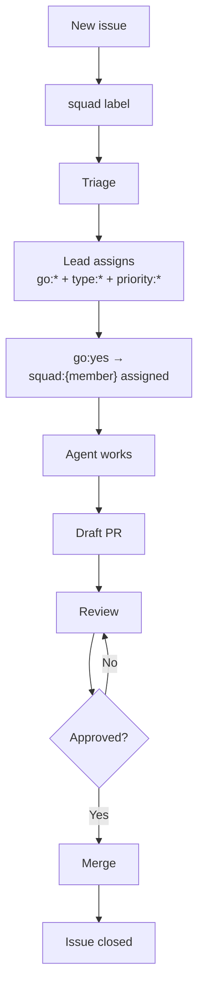

# GitHub Integration

> ⚠️ **Experimental** — Squad is alpha software. APIs, commands, and behavior may change between releases.


Squad plugs directly into your GitHub workflow — issues become branches, branches become PRs, PRs become merged code. No context-switching, no copy-paste, no ticket juggling. Just tell your squad what to build and watch the commits roll in.

---

## Try This

```
Connect to myorg/myrepo and show me the backlog
```

```
Work on issue #42
```

```
Ralph, go — process the backlog until it's clear
```

---

## How It Works

The lifecycle is simple: **connect → backlog → work → PR → merge**.

```
Connect repo  →  Show backlog  →  Assign issues  →  Agent branches + implements
                                                            ↓
                  Merge PR  ←  Review feedback  ←  Agent opens PR
```

| You say | What happens |
|---------|-------------|
| `"Connect to myorg/myrepo"` | Stores issue source in `team.md` (once per project) |
| `"Show the backlog"` | Fetches and displays open issues in a table |
| `"Work on #12"` | Agent creates branch, implements, opens PR |
| `"Work on #12 and #15"` | Parallel work — each issue gets its own branch and PR |
| `"There's review feedback on PR #24"` | Author agent reads comments and pushes fixes |
| `"Merge PR #24"` | Squash-merge, delete branch, close linked issue |
| `"What's left?"` | Refreshes backlog, shows remaining open issues |

**Prerequisite:** Install and authenticate the `gh` CLI (`gh auth login`). Squad uses it for all GitHub operations.

---

## Working with your team

Squad is built for mixed teams — humans set direction, AI agents execute and report back. The Lead agent bridges between them, routing work and surfacing decisions when a human needs to act.

### Humans in the lifecycle

The following is **one example** of how a mixed team might divide responsibilities. Your team decides its own process — use [ceremonies](../features/ceremonies.md) and [directives](../features/human-team-members.md) to shape the workflow that fits.

| Stage | Who acts | What happens |
|-------|----------|--------------|
| **Triage** | Human (or Lead) | Applies `go:yes` / `go:no` — decides what's worth building |
| **Design review** | Human + team | Auto-triggered ceremony before multi-agent work; humans can participate or observe |
| **Implementation** | AI agents | Branch, build, test, open PRs — no human input required |
| **PR review** | Human | Reviews and approves (or requests changes); lockout protocol prevents conflicting edits |
| **Merge** | Human or Ralph | Squash-merge, branch cleanup, issue closed |

This is a starting point. Define your own checkpoints by configuring [ceremonies](../features/ceremonies.md) and capturing [directives](../features/human-team-members.md).

For details on how work routes to humans, see [Human team members](../features/human-team-members.md).

For ceremony details, see [Ceremonies](../features/ceremonies.md).

For agent anatomy and how each team member (AI, human, @copilot) is structured, see [your-team.md](your-team.md).

---

## Label Taxonomy

Labels aren't just tags — they're Squad's **state machine**. Five namespaces drive workflow automation, routing, and lifecycle tracking.

| Namespace | Purpose | Example Values | Mutual Exclusivity |
|-----------|---------|----------------|-------------------|
| `go:` | Verdict | `go:yes`, `go:no`, `go:needs-research` | ✅ One per issue |
| `release:` | Release target | `release:v0.4.0`, `release:backlog` | ✅ One per issue |
| `type:` | Issue category | `type:feature`, `type:bug`, `type:spike`, `type:docs`, `type:chore`, `type:epic` | ✅ One per issue |
| `priority:` | Urgency | `priority:p0`, `priority:p1`, `priority:p2` | ✅ One per issue |
| `squad:{member}` | Agent assignment | `squad:fenster`, `squad:hockney` | ❌ Multiple OK (pair work) |

Within `go:`, `release:`, `type:`, and `priority:`, applying a second label **auto-removes** the first. The `squad:{member}` namespace allows multiple labels for collaborative work.

### How Labels Drive Automation

Labels power four automation layers:

1. **Enforcement** — `label-enforcement.yml` watches for changes and removes duplicates within a namespace.
2. **Sync** — Cross-namespace cascading: `go:no` → auto-adds `release:backlog`; `priority:p0` → ensures `go:yes`.
3. **Triage** — Ralph uses labels to route work: `squad:fenster` → Fenster picks it up; no `squad:*` + `type:bug` → routes based on `routing.md`.
4. **Heartbeat** — `squad-heartbeat.yml` runs every 30 minutes, auto-triaging unassigned issues and escalating stale research.

### State Machine Flow



Labels are created automatically during `init` or `upgrade`. Add custom labels with:

```bash
gh label create "squad:designer" --color "0366d6" --description "Work assigned to Designer"
```

---

## Ralph — Work Monitor

Ralph is a built-in squad member who tracks the work queue, monitors CI status, and keeps the team moving. He's always on the roster — no casting required.

### Talking to Ralph

| You say | What happens |
|---------|-------------|
| `"Ralph, go"` | Activates the self-chaining work loop |
| `"Ralph, status"` | Single check cycle, reports board state |
| `"Ralph, idle"` | Stops the loop |
| `"Ralph, scope: just issues"` | Monitors only issues, skips PRs/CI |

### What Ralph Monitors

| Signal | Action |
|--------|--------|
| Untriaged issues (no `squad:{member}` label) | Lead triages and assigns |
| Assigned but unstarted issues | Spawns agent to pick it up |
| Draft PRs from squad members | Checks if agent is stalled |
| Review feedback on PRs | Routes to author agent |
| CI failures | Notifies agent to fix |
| Approved PRs | Merges and closes issue |

Ralph **never stops on his own while work remains** — he keeps cycling until the board clears, you say "idle", or the session ends. Every 3–5 rounds he posts a status update and keeps going.

### Three Layers of Ralph

| Layer | When | How |
|-------|------|-----|
| **In-session** | You're at the keyboard | `"Ralph, go"` — active loop |
| **Local watchdog** | You're AFK but machine is on | `squad watch --interval 10` |
| **Cloud heartbeat** | Fully unattended | `squad-heartbeat.yml` GitHub Actions events |

The heartbeat workflow (`squad-heartbeat.yml`) is installed during `init` or `upgrade`. It runs on issue close, PR merge, and manual dispatch. Edit the workflow in `.github/workflows/squad-heartbeat.yml` to customize triggers. For periodic polling without events, use `squad watch` locally.

**PAT requirement:** Ralph needs `gh` CLI authenticated with a Classic PAT (scopes: `repo` and `project`). The default `GITHUB_TOKEN` doesn't have sufficient scopes.

---

## PRD Mode

Got a product spec? Hand it to Squad and the Lead decomposes it into prioritized, dependency-tracked work items.

```
Read the PRD at docs/product-spec.md and break it into work items
```

The Lead agent:
1. Decomposes the spec into discrete work items (WI-1, WI-2, etc.)
2. Assigns priorities: P0 (must-have), P1 (important), P2 (nice-to-have)
3. Routes items to agents based on domain expertise
4. Tracks dependencies — won't start WI-4 if it depends on WI-2

Independent items run in parallel. When requirements change, give Squad the updated PRD — the Lead diffs against existing items and adjusts the backlog without undoing completed work.

---

## Project Boards

Squad integrates with GitHub Projects V2 for visual workflow tracking. **Labels are the source of truth** — boards are one-way projections that visualize the state machine.

| Board Column | Label State |
|--------------|-------------|
| **Backlog** | `go:no` or `release:backlog` |
| **Needs Research** | `go:needs-research` |
| **Ready** | `go:yes`, no `squad:*` |
| **In Progress** | `go:yes` + `squad:{member}` |
| **Done** | Issue closed |

Board sync runs on label changes, issue close, PR merge, and a 30-minute schedule. Dragging an issue on the board triggers a webhook that applies the corresponding label.

**Status:** Label-based state machine is fully implemented. Automated board sync workflows are in development for v0.4.0. You can use `gh project` commands now — full automation is coming.

---

## Notifications

Your squad pings you when they need input, hit an error, or finish work. Squad uses MCP-based notification servers — you bring your own delivery channel.

See the [Notifications Guide](../features/notifications.md) for [platform setup](../features/notifications.md#quick-start-teams-simplest-path) (Teams, Discord, iMessage, webhooks), [trigger configuration](../features/notifications.md#what-triggers-a-notification), and [sample MCP configs](../features/notifications.md#sample-mcp-configs).

---

## Tips

- You don't need to assign issues to agents — Squad routes based on domain expertise defined in charters and `routing.md`.
- If `gh` isn't authenticated, Squad will tell you. Run `gh auth login` first.
- Use `priority:p0` to fast-track critical items — it auto-sets `go:yes`.
- Combine PRD mode with GitHub Issues to auto-create issues from work items.
- Ralph's in-session loop is session-scoped — state resets between sessions. Use `squad watch` or the heartbeat for persistent monitoring.

---

## Sample Prompts

```
connect to bradygaster/squad and show me the backlog
```

Links Squad to a GitHub repo and displays all open issues.

```
work on all issues labeled "bug"
```

Processes multiple bug issues in parallel — each gets its own branch and PR.

```
mark issue #42 as approved for v0.4.0
```

Applies `go:yes` and `release:v0.4.0` labels, removing any conflicting labels.

```
Ralph, go — start monitoring and process the backlog until it's clear
```

Activates Ralph's self-chaining loop to continuously triage, assign, and process work.

```
read the PRD at docs/product-spec.md and break it into work items
```

Ingests a product spec and creates a prioritized, dependency-tracked backlog.

```
there's review feedback on PR #24
```

The author agent reads review comments and pushes fixes to the existing branch.

```
list all p0 features approved for the next release
```

Queries issues with `priority:p0 + type:feature + go:yes + release:{current milestone}`.

```
squad watch --interval 5
```

Starts persistent local polling — checks GitHub every 5 minutes for new work and triages automatically.
